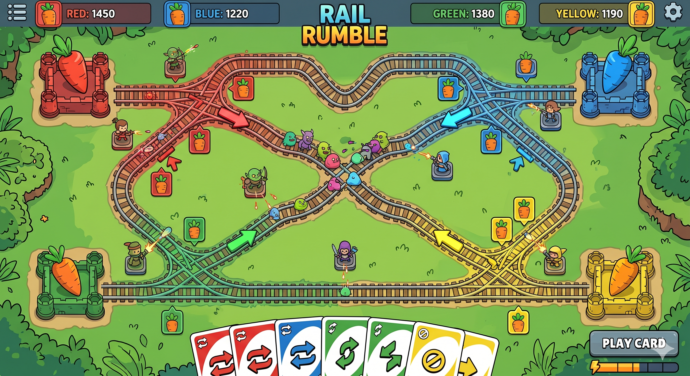
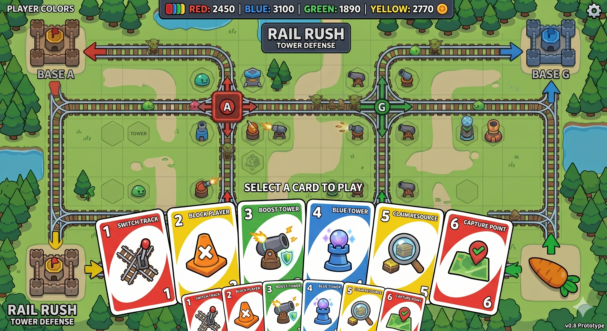
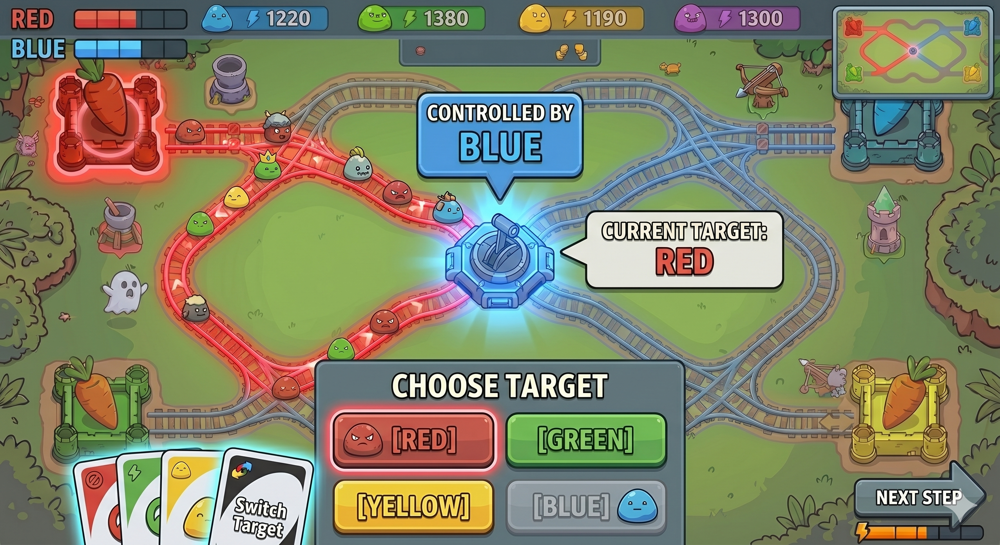
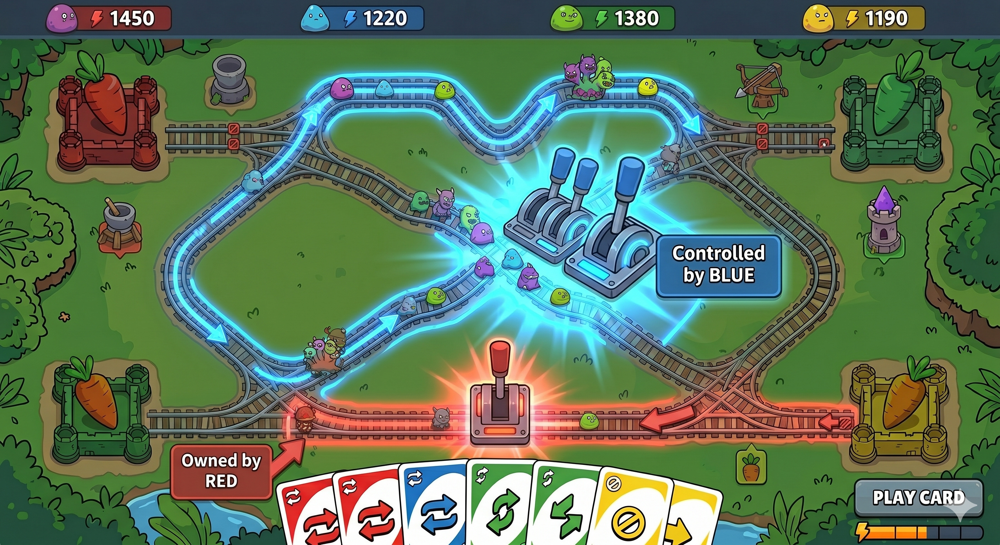

# CanalTD

> This is a historical design iteration document. The final assessed design is summarised in [FinalGame/FINAL_GAME_DESIGN.md](./FINAL_GAME_DESIGN.md).

CanalTD is a turn-based multiplayer strategy game where players control canal gates and path direction to redirect enemy waves toward opponents.

---

## Core Idea

Instead of directly attacking other players, the game focuses on indirect interaction.

Players:
- control canal gates and direction-change points
- redirect enemy waves
- try to survive while influencing others

The goal is to combine **strategy, chaos, and social gameplay**.

---

## Development Note

The idea for this project was not created entirely within the prototype week.  
I started thinking about the concept a few days earlier and discussed it with friends, iterating on how to make the core mechanic (enemy redirection) interesting and interactive.

Because of that, the overall structure was already quite clear before building the prototype, which allowed me to develop the design relatively quickly.

---

## Core Gameplay Loop

Each turn, a player will:

1. Draw a card  
2. Play a card  
3. Build towers or change path direction  

Enemies continuously move through the system, and players influence **where they go** rather than simply stopping them.

---

## Main Gameplay Screen

- 4 players (Red, Blue, Green, Yellow)
- Each player protects their own base (carrot)
- Enemies move along fixed paths
- Towers automatically attack enemies
- Players influence enemy routes using cards and node control

---

## Player Turn Flow

- Turn-based system
- Clear step-by-step interaction
- Active player is highlighted
- UI helps guide decisions

---

## Card System

Cards are the main way players interact with each other.

Examples:
- Switch Track → change enemy direction
- Block Player → restrict opponent actions
- Boost Tower → temporarily increase damage
- Capture Point → gain control of a node
- Claim Resource → gain advantage

This system is inspired by UNO-style interaction combined with strategy elements.

---

## Core Mechanic: Intersection Control

- Canal gates and direction-control nodes act as controllable map points
- Each node is owned by a player
- Only the owner can change its direction

This creates:
- strategic control over the map
- indirect player interaction without direct attacks

---

## Target Selection Mechanic

Players can choose a target opponent.

- The selected player becomes the destination of enemies
- The UI clearly shows the current target
- Ownership and flow direction are visually indicated

---

## Enemy Routing Result

After switching:

- Enemy paths update dynamically
- Enemies are redirected toward the selected player
- Flow is visualized through colored tracks

This is effectively the main “attack” mechanic of the game.

---

## Basic Rules

- Each player protects their own base
- Base HP = 0 → player loses
- The game ends after all waves
- Final ranking is based on score

### Scoring

- Killing enemies → +Score  
- Taking damage → -Score  

---

## Match Results

- Player rankings
- Score breakdown based on performance

---

## Target Users

### 1️⃣ Players who enjoy indirect competition  
This game is designed for players who prefer influencing others rather than direct combat.  
Instead of attacking opponents directly, players interact by controlling enemy flow and creating pressure through the system.

---

### 2️⃣ Players who like both strategy and unpredictability  
The game combines planning and randomness.  
Players can make strategic decisions through map control, while the card system introduces moments of unpredictability that keep the experience dynamic.

---

### 3️⃣ Players who enjoy social and interactive gameplay  
CanalTD is intended for small groups of players who enjoy interacting during gameplay.  
Players can cooperate, compete, or disrupt each other, making the experience more engaging in a shared setting.

---

### 4️⃣ Casual players who want depth without complexity  
The core rules are simple and easy to understand, making the game accessible.  
At the same time, the interaction between timing, positioning, and player decisions adds depth for those who want to think more strategically.

---

## Asset & Image Disclaimer

The visual assets in this prototype (UI mockups, scenes, and interface elements) were generated using Gemini based on my design prompts.

This was mainly to improve clarity and readability of the gameplay ideas, as I wanted to present the mechanics more clearly than rough sketches.

These images are used only for:
- concept visualization  
- system explanation  
- presentation purposes  

They do not represent a fully implemented game.

All gameplay mechanics, system design, and interaction ideas are original work.
