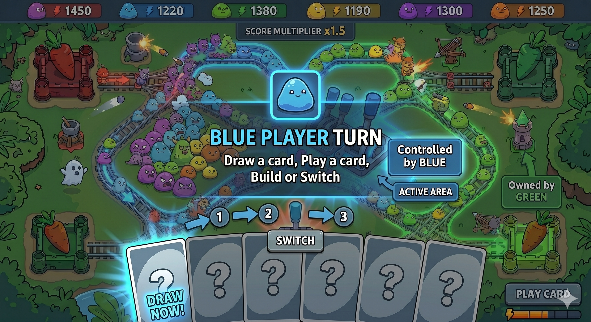
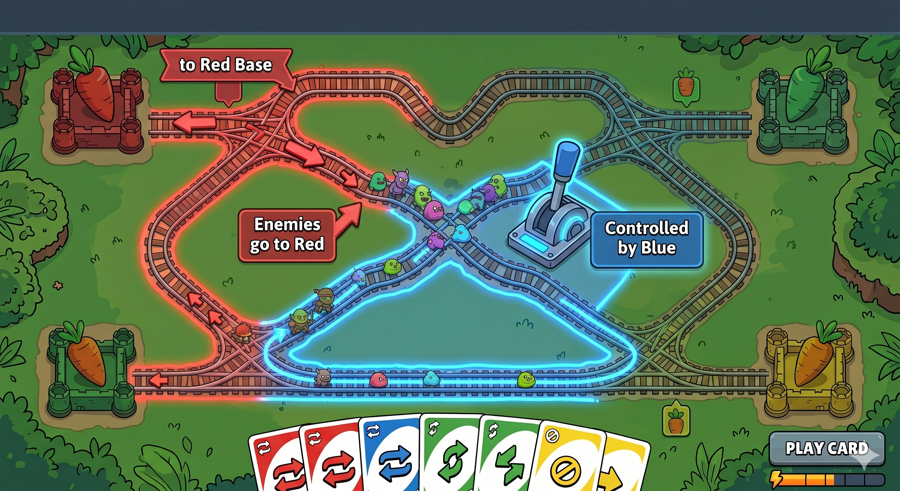
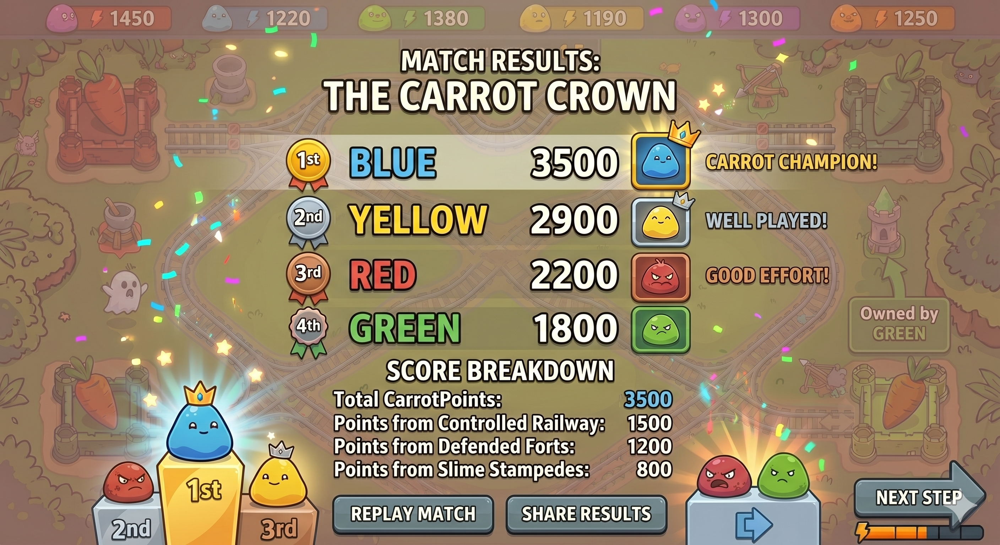

# 🚂 Rail Rumble

A competitive multiplayer tower defense game where players **control railway intersections** to redirect enemies toward opponents.

---

## 🎯 Core Idea

Players do not directly attack each other.

Instead, they:
- Control railway switches (intersections)
- Redirect enemy waves
- Compete for survival and score

👉 Strategy + Chaos + Social interaction

---

## 🧠 Core Gameplay Loop

Each turn, a player will:

1. Draw a card  
2. Play a card  
3. Build towers or switch railway direction  

---

## 🎮 Main Gameplay Screen

- 4 players (Red, Blue, Green, Yellow)
- Each player protects their own base (carrot)
- Enemies travel along railway tracks
- Towers automatically attack enemies
- Players influence enemy routes using cards

---

## 🔄 Player Turn Flow

- Turn-based system
- Clear step-by-step flow
- Active player highlighted
- UI guides decision making

---

## 🃏 Card System

Cards are the **main interaction system**.

Examples:
- Switch Track → change enemy path
- Block Player → disrupt opponent
- Boost Tower → increase damage
- Capture Point → gain control
- Claim Resource → gain advantage

👉 Inspired by UNO-style interaction + strategy cards

---

## 🧠 Core Mechanic: Intersection Control

- Railway intersections are **controllable nodes**
- Each node has an owner (player)
- Only the owner can change its direction

👉 This creates:
- Strategic control zones
- Player conflict without direct combat

---

## 🎯 Target Selection Mechanic

Players can choose a **target opponent**.

- Selected target becomes the destination of enemies
- Current target is clearly displayed
- UI highlights ownership and flow direction

---

## 🛤️ Enemy Routing Result

After switching:

- Enemy path dynamically updates
- Enemies are redirected to the chosen target
- Flow direction is visualized with colored tracks

👉 This is the core "attack" mechanism of the game

---

## 📘 Basic Rules

- Each player protects their own base
- Base HP = 0 → player loses
- Game ends after all waves
- Final ranking based on score

### 🧠 Scoring

- Kill enemies → +Score  
- Base takes damage → -Score  

---

## 🏆 Match Results

- Ranking of all players
- Score breakdown:
  - Controlled railway
  - Defense performance
  - Enemy waves handled

---

## 🎮 Design Highlights

### 1️⃣ Indirect PvP
No direct attacks — all interaction happens through:
- Path control
- Enemy redirection

---

### 2️⃣ Strategy + Randomness
- Card system introduces randomness
- Control system rewards planning

---

### 3️⃣ Social Gameplay
Players can:
- Cooperate
- Betray
- Redirect enemies to others

---

### 4️⃣ Easy to Play, Hard to Master
- Simple rules
- Deep strategy through:
  - Map control
  - Timing
  - Card usage

---

## 🛠️ Tech / Prototype Notes

- 2D top-down design
- Turn-based system (single-device multiplayer friendly)
- Pathfinding based on dynamic graph switching
- UI-driven interaction

---

## 🚀 Future Improvements

- More card types
- Better balance system
- More maps with complex intersections
- Online multiplayer support

---

## 📌 Summary

Rail Rumble is a **strategy + party-style tower defense game** where:

> 💥 You don't attack players —  
> 💥 You send chaos to them.
